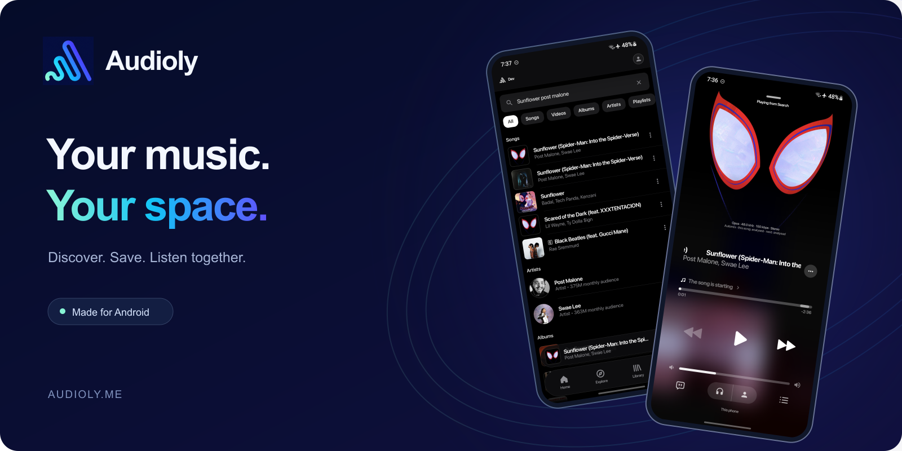
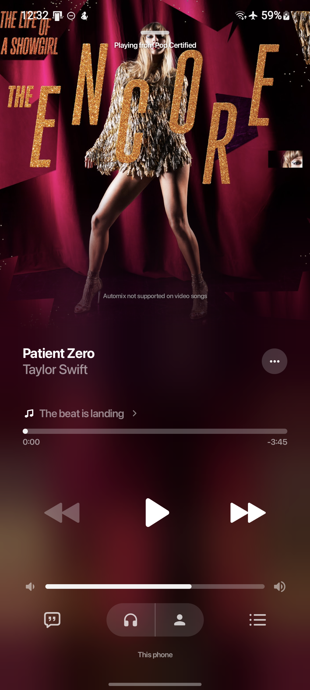
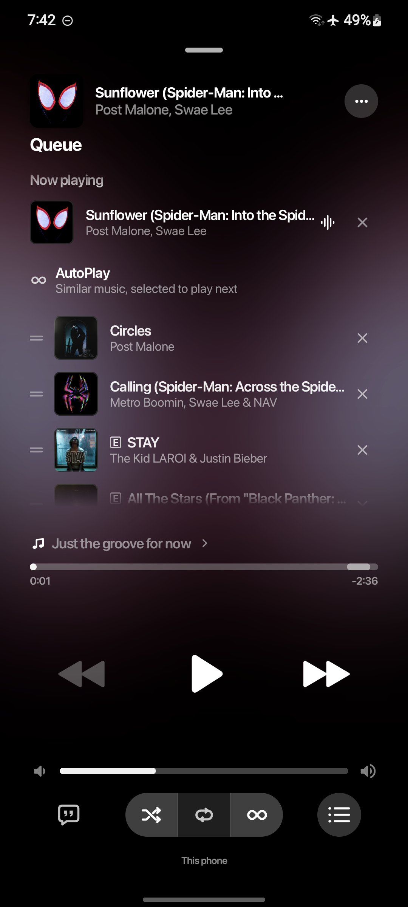
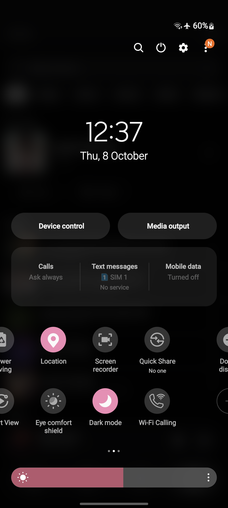

<p align="center"></p>

<p align="center">
  <strong>A personal music app for Android, built around the way you listen.</strong><br />
  Discover music, bring your playlists, save favourites, and listen together.
</p>

<p align="center">
  <a href="https://audioly.me">Website</a> ·
  <a href="#inside-audioly">Features</a> ·
  <a href="#build-it-yourself">Build</a> ·
  <a href="docs/PUBLISHING.md">Publishing guide</a>
</p>

<p align="center">
  
  
  
</p>

## Made for the music

A full-screen player that follows the artwork. Playlists that feel at home. Lyrics, a flexible queue, and a library that travels with you.

<p align="center">
  
  
  
</p>

<sub>Real device captures. Music, artwork, artist names and service marks belong to their respective owners. Catalog availability varies.</sub>

## Inside Audioly

| Your listening | What you get |
| --- | --- |
| Discover | YouTube Music browsing and search, with optional Spotify-powered Home and search. |
| Bring your library | Spotify playlists and liked songs, public playlist imports, local audio, and saved favourites. |
| Make it yours | Artwork-led player colours, lyrics, equalizer, queue controls, and manual playback-match correction. |
| Take it offline | Downloads with progress and retry controls, subject to source availability and your network settings. |
| Listen together | Shared parties with a room code or an `audioly.me` invitation link. Requires a running party server. |
| Keep listening | Background playback, media controls, Android Auto integration, and listening history. |

### How Spotify playback works

Spotify supplies catalog and playlist information. Audioly matches those tracks to a playable YouTube source; it does **not** stream Spotify's protected audio. Matches are cached, and a wrong match can be corrected manually. An uncached track still needs a network lookup. Private library features require connecting your Spotify account; upstream changes and rate limits can affect availability.

See [Spotify integration notes](docs/SPOTIFY_INTEGRATION.md) for implementation details and current limitations. Audioly is an independent project and is not affiliated with Spotify, Apple, Google, or YouTube.

## Get Audioly

Visit [audioly.me](https://audioly.me) for the project website. This source snapshot does not bundle an APK. Maintainers should attach signed builds to GitHub Releases; see the [release checklist](docs/PUBLISHING.md). Never share signing keys or account tokens.

## Build it yourself

Requirements: **JDK 17**, Android SDK **37** (target SDK 36), and the CMake/NDK components requested by Gradle. Minimum supported Android version: **8.0 / API 26**.

1. Open the repository in Android Studio and let Gradle sync.
2. Set your SDK path in `local.properties` if Android Studio has not created it. Optional configuration is shown in `local.properties.example`.
3. Build and test:

```bash
./gradlew :app:testDevDebugUnitTest :app:assembleDevDebug
```

On Windows, use `gradlew.bat`. APKs are written to `app/build/outputs/apk/dev/debug/`.

| Variant | Application ID | Purpose |
| --- | --- | --- |
| Dev | `com.dev.audioly` | Development and testing; separate app data. |
| Prod | `com.music.audioly` | Distribution builds. |

For a production build, run `./gradlew :app:assembleProdRelease`. Configure your own `keystore.properties` from the example before distributing it; without signing configuration the release output is unsigned. Keep the same signing key for future updates.

## Project map

```text
app/          Android application, Compose UI and playback
native/       Audio analysis and DSP code
backend/      Go Listen Together server
deployment/  Server and website configuration examples
docs/        Integration notes, publishing guide and screenshots
```

The party backend and website are optional for local development. See [backend documentation](backend/README.md) and [deployment instructions](deployment/README.md). Deployment requires your own infrastructure and credentials; CI never deploys automatically.

## Contributing

Bug reports should include the app version, Android version, steps to reproduce, and relevant redacted logs. Avoid posting cookies, tokens, private playlists, or signing files. See [CONTRIBUTING.md](CONTRIBUTING.md).

## License

Distributed under [GPL-3.0](LICENSE). See [license notices](NOTICE.md).
